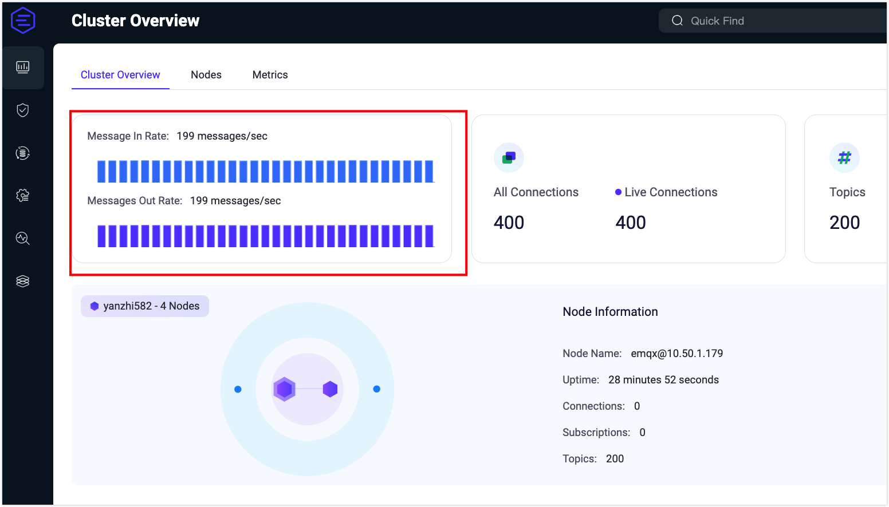
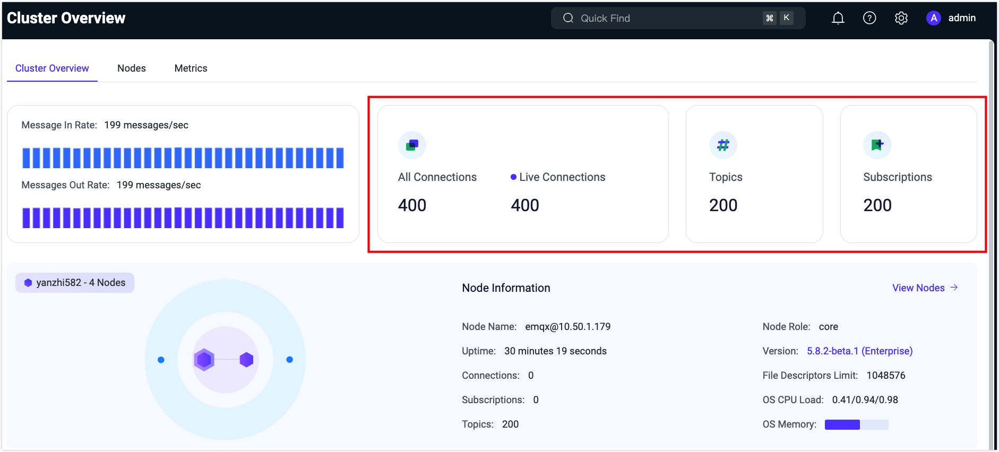
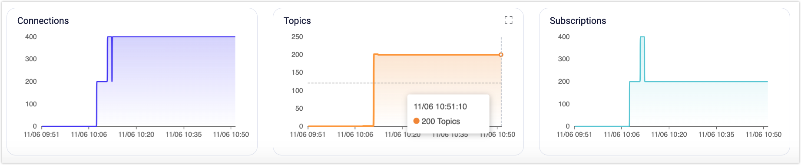
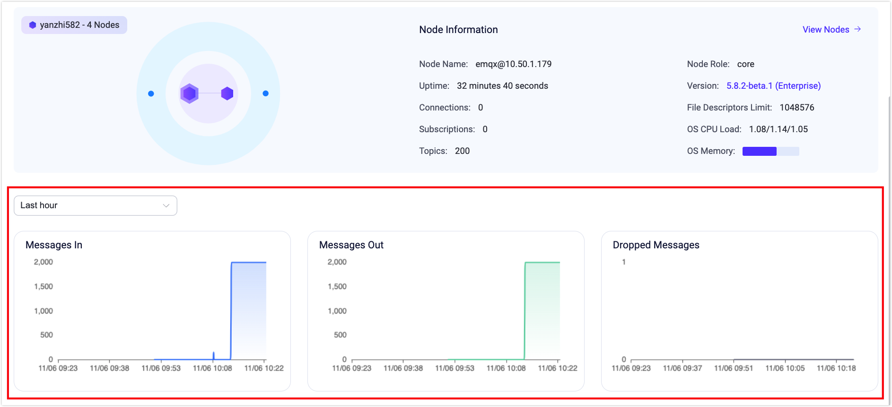
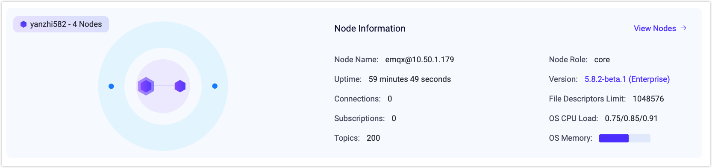
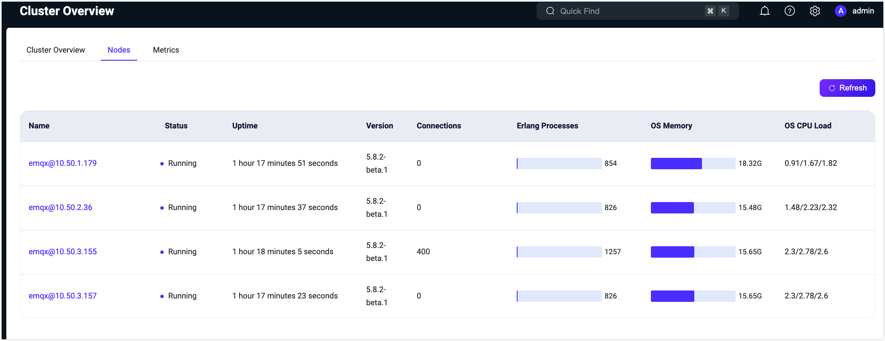

# Dashboard Home Page

After successful login, you can access the home page of the EMQX Dashboard, specifically the **Cluster Overview** page. This page includes the following tabs:

- **Cluster Overview**: Displays an overview of the data across the entire cluster.
- **Nodes**: View the list of nodes and node-specific information within the cluster.
- **Metrics**: View all data metrics within the cluster or individual nodes.

## Cluster Overview

This page provides an overview of the data for the entire EMQX cluster in operation, including the following information.

### Message Rate

In EMQX, messages represent the key data transmitted by all connected MQTT clients or real devices. Clients or devices send and receive messages through topics, enabling data communication between them.

The card in the upper left corner of this overview page provides a clearer and easier way to monitor the rate changes in the current volume of messages incoming and outgoing in the system (message rate is measured in how many messages per second) by visualizing the rate spectrum with real-time rate values.

### Connections and Subscriptions

As an MQTT broker, the number of connections and topics subscribed to EMQX is one of the most important metrics to observe. The connections are the number of MQTT clients or real devices currently connected to EMQX, the number of subscriptions is the total number of topics currently subscribed to in each client, and topics are the unique subscriptions.

In the card on the top right of the overview page, you can quickly see the number of connections, subscriptions, and topics in the cluster. The statistics in the card will be updated in real-time when a connection or a subscription topic is updated.

::: tip

Subscriptions are differentiated by client, while topics are unique subscriptions and the same topic may be included in different clients.

:::

In addition to providing real-time statistics, the bottom of the page also provides a visual chart that allows you to view historical and current changes in the number of connections and subscriptions by time (the time format: YYYY/MM/DD HH:mm), which allows you to monitor the trend of the number of connections and subscriptions within the entire EMQX cluster more clearly and intuitively. Hovering over the chart and clicking the icon in the top right corner allows you to enlarge the chart.

### Messages

The number of messages is the statistics of the number of data transferred between clients or devices, and on the page includes the incomming, outgoing and dropped messages.

In the lower part of the overview page, you can see a visual chart of the number of messages, and view the historical and current number of messages by time change (the time format: YYYY/MM/DD HH:mm), which allows users to better monitor dynamically the real-time changes of all messages within the current EMQX cluster. Hovering over the chart and clicking the icon in the top right corner allows you to enlarge the chart.

::: tip

All of the above time-varying charts can be viewed by selecting the time range in the upper left corner: statistics are available for data changes over the past 1 hour, past 6 hours, past 12 hours, past 1 day, past 3 days, and past 7 days.

:::

## Nodes

EMQX, the most scalable MQTT broker for IoT, supports cluster deployment, where each EMQX instance within the cluster functions as a node.

### Node Data

You can monitor the whole EMQX cluster by the card in the middle of the overview page, including a topology diagram to visualize the association and distribution of all nodes in the cluster.

Hover over a node in the topology diagram to view its basic information and operation status. This includes the node name, node role, number of connections, subscriptions, and topics, as well as the current EMQX version. Clicking on the version number opens the changelog for a quick overview of updates in the current version. Additionally, you can view the CPU load and memory usage of the operating system on which the node is deployed (memory metrics are only available for nodes deployed on Linux).

::: tip

If a node in the topology diagram turns gray, it indicates that the node is currently stopped.

:::

### Node List

Clicking **View Nodes** at the upper right corner of the node card or selecting the **Nodes** tab at the top navigates to the Nodes page. This page lists all nodes currently in the EMQX cluster, offering a quick view of each node's name, status, uptime, version, connections, Erlang process count, memory usage, CPU load, and other key metrics. Clicking the **Refresh** button in the top right corner updates the list with the latest node information in real time.

### Node Details

The node list can only show partial basic information about nodes. To view the comprehensive information about a node, click the node name in the **Name** column to access the node's details page. On the details page, you will find the following cards:

- In the **Node Info** card, in addition to basic node information, you can also view details such as the maximum file handle count for the current node, system paths, and log paths (displaying log paths requires enabling file log processing in the configuration).
- In the **Node Statistics** card, you can see various statistics about the current node, including the number of connections, subscriptions, topics, retained messages, sessions, and shared subscriptions. The statistics values are divided into two parts separated by a slash ("/"): the left side shows real-time data and the right side shows the high watermark data, which represents the peak values reached by the current data.

## Metrics

Clicking the **Metrics** tab at the top allows you to access the metrics page, where you can view all data metrics generated during the operation of the EMQX cluster or a specific node. This includes message information, message statistics, and traffic send/receive statistics. These metrics provide insights into the current service status.

In the dropdown menu at the top right corner, you can choose to view either cluster-wide data or data specific to a single node. Clicking the adjacent **Refresh** button enables real-time monitoring of metrics data on the current page.

For detailed explanations and comprehensive details of metric data, please visit [Metrics](../observability/metrics-and-stats.md).

### Connections, Sessions, and Access

The metric data covers 4 aspects: bytes, packets, messages, and events. In the card, you can view metric data related to events, including counts of events such as connection sessions and authentication and authorization events.

### Messaging

The four cards below provide statistics on the data generated during message transmission, such as statistics on traffic sent and received (in bytes), statistics on the number of packets, the number of messages and the number of messages delivered.

